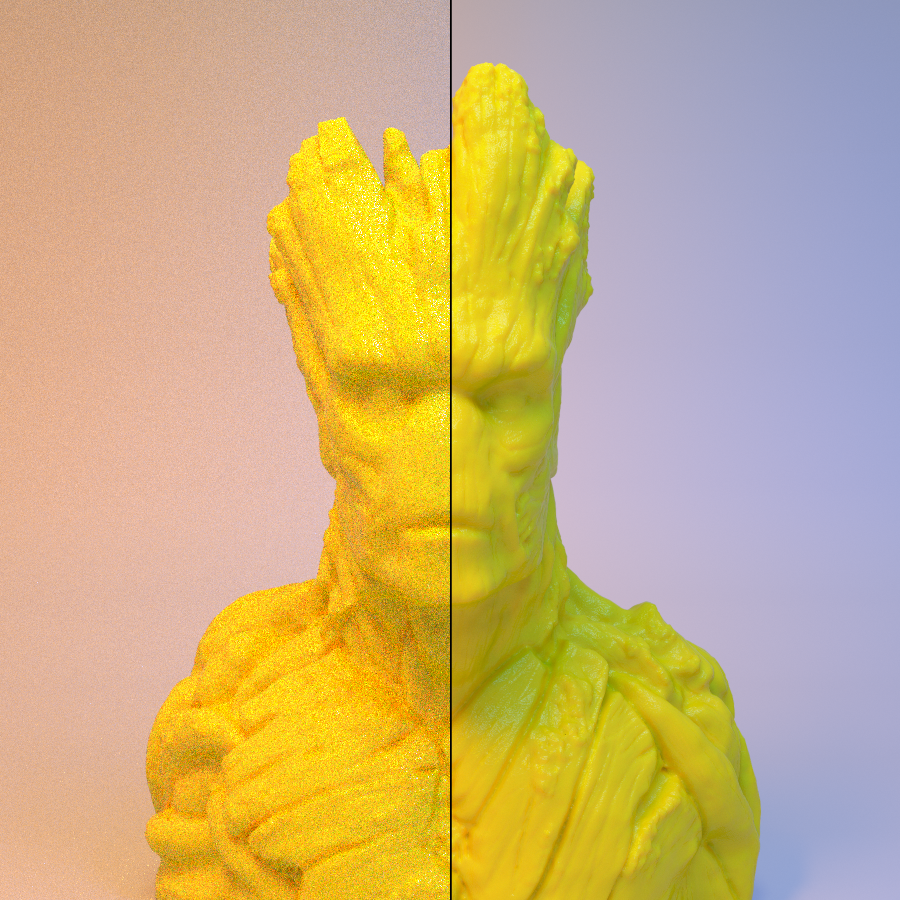

# imgavg
A command line utility that outputs the average of a number of pictures.

Left: 1 frame, 40 samples. Right: 250 merged frames, 40 samples each.

##Installation:
    pip install imgavg

##usage:
    $ imgavg -f images/ -o output.png

##limitations:
1. All images must be the same dimensions
2. All images must have the same amount of channels i.e. RGB, or RGBA
